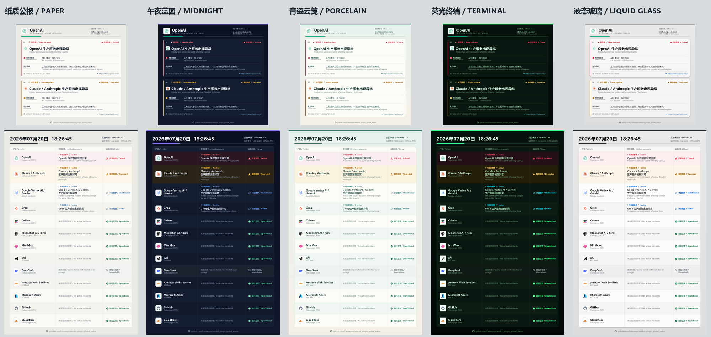
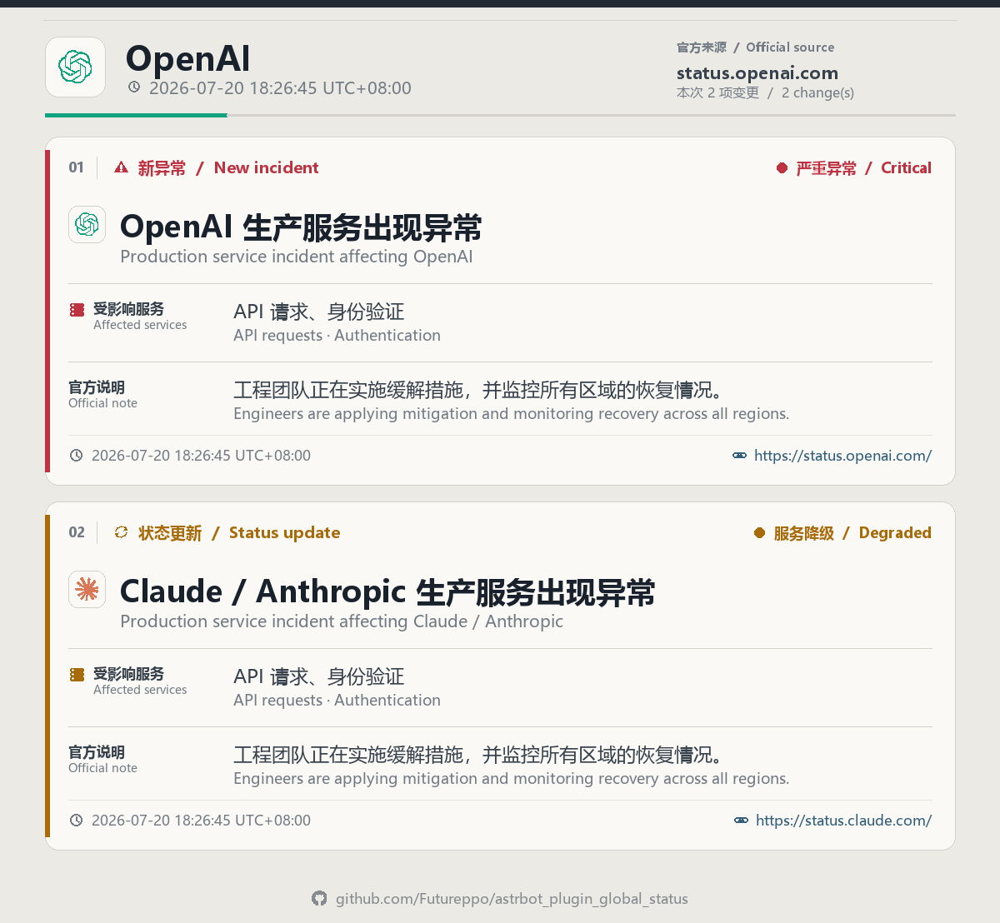
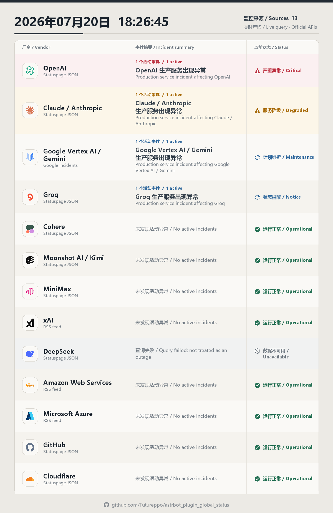

# AstrBot 全球厂商状态监控

面向所有具备群聊和主动推送能力的 AstrBot 平台适配器的状态告警插件。插件轮询官方状态接口，在服务出现异常、异常信息更新或恢复时生成精美的 PNG 状态卡并推送到指定群。卡片图标全部来自插件内置 SVG 资产，运行时在内存中栅格化，不需要 Cairo 等原生依赖。

## 图片示例

以下图片使用演示数据生成，仅用于展示排版和主题效果，不代表厂商真实服务状态。

### 五种主题对比

[](assets/screenshots/themes-comparison.png)

### 双语异常告警卡

[](assets/screenshots/alert-paper-bilingual.png)

### 全部厂商状态总览

[](assets/screenshots/overview-paper-bilingual.png)

## 内置来源

- OpenAI、Claude / Anthropic、Groq、Cohere、Moonshot AI / Kimi、MiniMax、xAI、DeepSeek
- Google Vertex AI / Gemini
- Amazon Web Services、Microsoft Azure
- GitHub、Cloudflare

OpenAI、Claude、Groq、Cohere、Moonshot AI、MiniMax、GitHub 和 Cloudflare 使用 Statuspage JSON；Google 使用 Google Cloud 事件 JSON；xAI、DeepSeek、AWS 和 Azure 使用官方 RSS/Atom Feed。DeepSeek 从官方状态页对应的 `deepseek.statuspage.io/history.atom` 订阅事件，但图片链接始终指向 `https://status.deepseek.com/`。还可以在插件配置中添加其他兼容 Statuspage JSON 的状态页。

## 配置

在 AstrBot WebUI 的插件配置中填写：

1. `platform_type`：推送平台类型，可选 `aiocqhttp`（默认）或 `qq_official`。
2. `group_whitelist`：允许接收告警的目标白名单。支持三种格式：纯数字群号（aiocqhttp）、group_openid（qq_official）、完整 UMO（任意平台）。默认值为空，因此刚安装时不会主动发送。

   **获取 UMO**：在目标群中向机器人发送 `/sid`，机器人会回复类似以下内容：

   ```
   UMO: 「1:GroupMessage:123456789」
   UID: 「10001」
   ...
   Platform ID: 「1」
   Message Type: 「GroupMessage」
   Session ID: 「123456789」
   ```

   将 `UMO:` 后面引号内的完整字符串（如 `1:GroupMessage:123456789`）填入白名单即可。UMO 格式为 `平台实例ID:消息类型:会话ID`，具有全局唯一性，填写后无需再配置 `platform_id` 和 `platform_type`。

   示例：
   - aiocqhttp 群号：`123456789`
   - qq_official 群 openid：`E4BE1234ABCD5678`
   - 完整 UMO：`1:GroupMessage:123456789`

   > 也可在目标群里用 `/厂商订阅 开` 让机器人自动把当前群 UMO 写入白名单（详见「命令 → 订阅开关」），无需手动复制 UMO。

3. `platform_id`：仅对纯群号/group_openid 条目生效（用于拼接 UMO）。如果白名单中全部使用完整 UMO 格式，此项无需填写。留空时自动选择对应类型下唯一的活跃实例；存在多个实例时必须明确填写。
4. `poll_interval_seconds`：默认 300 秒，最低 60 秒。
5. `sources`：可单独停用任意内置来源。
6. `notify_maintenance`：默认关闭，计划维护不会被当作服务故障。
7. `notify_existing_on_first_startup`：控制首次成功查询时是否推送厂商已有异常，默认开启。关闭时只建立状态基线，之后的更新和恢复仍会通知。
8. `display_language`：支持 `中英双语`、`简体中文` 和 `English`，默认中英双语。
9. `card_theme`：选择告警卡与总览图主题，提供 `纸质公报`、`午夜蓝图`、`青瓷云笺`、`荧光终端`、`液态玻璃` 五种样式，默认使用纸质公报。
10. `timezone`：控制总览图及告警卡内所有时间所使用的时区，统一精确到秒并显示 UTC 偏移。默认留空并跟随 AstrBot 全局"时区"设置；也可填写 `Asia/Shanghai` 等 IANA 时区名称单独覆盖。
11. `enable_ai_translation`：默认开启，调用 AstrBot 默认对话模型把官方英文事件翻译为简体中文。
12. `translation_provider_id`：通常留空；留空时使用默认对话模型，也可以为翻译单独选择模型。

### 图片主题

- `纸质公报`：当前默认样式，暖灰纸张、编辑部式分栏与克制的状态色。
- `午夜蓝图`：深海蓝黑底色、紫色结构线与柔和的高亮文字。
- `青瓷云笺`：浅青瓷底色、更圆润的卡片轮廓与低饱和绿色层次。
- `荧光终端`：近黑终端底色、直角结构与高对比荧光状态色。
- `液态玻璃`：仿照 iOS 的中性浅灰背景、半透明白色磨砂层、细高光边和柔和阴影，不使用蓝紫渐变。

插件使用 AstrBot 的全局 `http_proxy` 环境配置访问状态页，无需重复配置代理。

## 翻译与双语显示

- 双语模式把中文译文作为主内容，并在下方以较小字号保留官方英文原文；纯中文和纯英文模式可在配置中切换。
- 标题、官方更新正文和受影响服务会按轮次批量翻译，译文保存到插件独立 KV 缓存，同一内容不会反复消耗模型调用。
- 翻译只影响图片展示，不参与事件指纹和告警去重。译文变化不会制造额外的“状态更新”。
- 默认对话模型未配置、调用超时或输出格式异常时，插件会直接显示官方原文并继续发送，不会丢失告警。
- 插件不会把事件文本发送给翻译模型以外的服务；具体数据处理方式取决于你配置的默认对话模型提供商。

## 命令

### 状态查询

- `/厂商状态`
- `/vendor_status`

以上命令行为相同：收到指令后立即抓取所有启用来源并返回最新状态总览图，不会修改自动告警的去重或送达状态。命令目前在 aiocqhttp 和 qq_official 平台生效，群聊和私聊均可使用。

### 订阅开关

- `/厂商订阅 开`：开启当前群的厂商状态自动推送——把本群 UMO 写入 `group_whitelist` 并持久化保存，下一轮轮询后开始收到告警。
- `/厂商订阅 关`：关闭当前群的自动推送——从 `group_whitelist` 移除本群 UMO 并持久化保存，停止向本群推送。

说明：
- 仅 **Bot 管理员**可在 **群聊** 中使用；非管理员或私聊执行会被拒绝。
- 参数只识别确切的 `开` / `关`；填写其它内容（含为空）只返回用法提示，不会改动配置。
- 重复开启/关闭是幂等的，不会重复写盘。
- 效果与在 WebUI 手动编辑 `group_whitelist` 等价，区别在于该指令直接落盘、重启后保持。

## 通知规则

- 默认在首次成功检查时立即报告当时已经存在的异常；可通过 `notify_existing_on_first_startup` 关闭首次存量告警。
- 相同状态不会重复发送；严重度、受影响服务或官方说明变化时会发送更新。
- JSON 来源明确恢复后立即通知；RSS/Atom Feed 明确标记恢复时立即通知，未明确标记的事件连续两轮成功检查均消失后通知恢复。
- 单个来源请求失败不会被误判为恢复，也不会额外向群内发送“监控失败”告警。
- 某个群发送失败时，下轮只重试该群。

## 图标

OpenAI、Claude、Google Vertex AI / Gemini、Groq、Cohere、Moonshot AI、MiniMax、xAI、DeepSeek、AWS、Azure、GitHub 和 Cloudflare 的厂商 SVG 标识来自 [LobeHub Icons](https://icons.lobehub.com/components/lobe-hub)（`@lobehub/icons-static-svg@1.94.0`，MIT License）。许可全文随插件保存在 `assets/icons/LOBEHUB_LICENSE.txt`，各品牌名称与商标归其权利人所有。

所有图标均内置在插件中，运行时不会联网下载。告警阶段、严重度、服务、时间和链接也使用本地 SVG；自定义 Statuspage 来源没有匹配的厂商标识时继续使用通用厂商 SVG，不会生成首字母头像。

## 故障排查

- 没有主动消息：确认 `group_whitelist` 非空，并确认对应平台已连接。
- 多个同类型实例：在 `platform_id` 中填写目标实例 ID。
- 状态查询显示"数据不可用"：检查 AstrBot 日志、网络连接和全局代理配置。
- 图片没有中文译文：确认已启用 AI 翻译并配置了可用的默认对话模型；详细原因会记录在 AstrBot 日志中。
- 中文显示为方框：可在 AstrBot `data/font.ttf` 放置支持中文的字体。插件也会自动尝试微软雅黑、Noto CJK 和苹方。

## 已知限制

- **平台兼容性**：插件推送仅依赖 `Image` 消息组件和 `context.send_message()`，理论上所有支持群聊 + 主动推送 + 发图的适配器均可使用（见 `metadata.yaml` 中 `support_platforms` 列表）。但目前仅在 **aiocqhttp** 和 **qq_official** 上经过实际测试验证，其他平台填 UMO 后理论上可用，如遇问题请反馈。
- **QQ 官方机器人群主动推送需要前置交互**：QQ 官方 API 的群消息发送依赖适配器内存中缓存的会话场景（`scene="group"`）。AstrBot 重启后缓存清空，在机器人再次收到该群的消息之前，主动推送会被适配器静默跳过（日志中会出现 `[QQOfficial] No cached msg_id for session` 警告）。这是 QQ 官方 API 的设计约束，非插件 bug。解决方法：确保机器人在目标群中至少被 @ 过一次（或收到过群消息），之后的主动推送即可正常工作。
- **不支持的平台**：微信公众号（无主动推送）、微信客服（无群聊）、WebChat（无群聊）不支持本插件的主动告警功能。
- **企业微信仅应用模式可用**：`wecom` 适配器在客服模式（kf）下不支持主动发送群消息，`send_by_session` 会直接抛异常。请确保企业微信配置为应用模式后再使用本插件推送。
